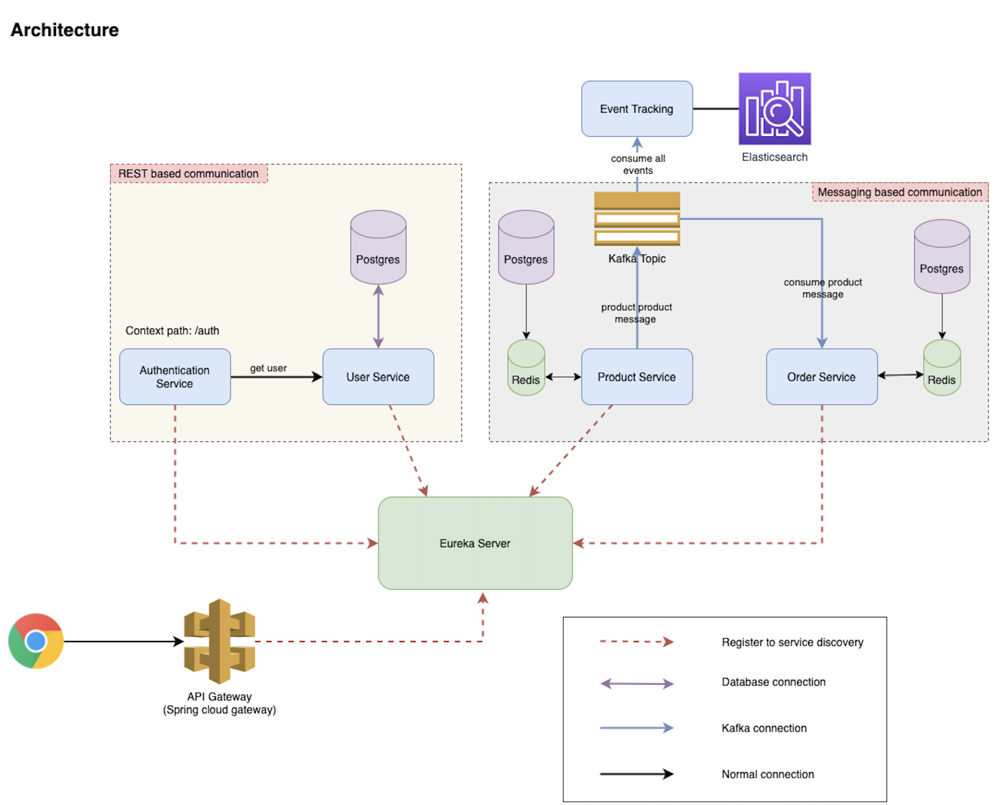

<h1 align="center">BOOTSTRAP</h1>
> this repo serves as an example to give to your team with the service you want to run 

### 🏗️ ARCHITECTURE



### 🎭 MONOREPO STRUCTURE
```sh
# clone git submodule
 git clone https://github.com/xotomicro/{SERVICE}.git > /dev/null
```

### 🐳 RUN WITH DOCKER 
> to install and run with docker follow : 
- [DOCKER](./documentation/deployment/DOCKER.md)